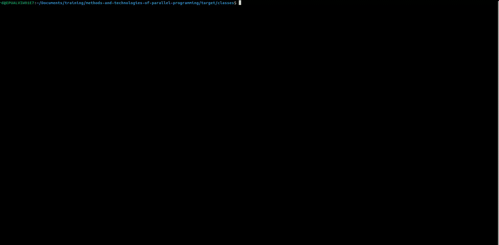
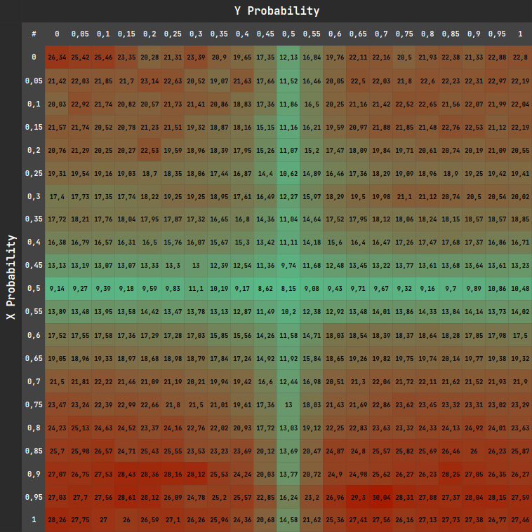

To accomplish this task special class [Particle](../../src/main/java/edu/kpi/lab03/particle/Particle.java) which represents elementary particle in a crystal.
This class extends Thread, so can run independently. Crystal is a shared memory and represented in this simulation as 2D array of AtomicInteger objects (to avoid synchronization issues).

Also the following strategies were implemented:
- [Timed Brownian motion simulation](../../src/main/java/edu/kpi/lab03/strategy/simulation/impl/TimedBrownianMotionSimulationStrategy.java)
- [Limited Brownian motion simulation](../../src/main/java/edu/kpi/lab03/strategy/simulation/impl/LimitedBrownianMotionSimulationStrategy.java)

These strategies can be launched through the command line interface (CLI).
To run the simulation, user must enter values for the following mandatory parameters:
- first dimension of matrix (N)
- second dimension of matrix (M)
- quantity of particles (K)
- probability for X axis
- probability for Y axis
- number of method

After choosing the method of simulation, user will be prompted to enter specific parameter:
- total time of execution (for Timed Brownian motion simulation)
- total number of iterations (for Limited Brownian motion simulation)
- interval of execution (for both)

### Example of Timed Brownian motion simulation execution

### Example of Limited Brownian motion simulation execution

Also interesting dependence of execution duration on the probability value was found.
Analyzation test was executed and data was processed with following table:

Such behavior can be explained by quantity of collisions (in our case collision is a concurrent modification of the same
crystal cell by multiple threads). When probabilities are close enough to 0.5, the particles move with a character close to random.
Instead, when the probability value approaches 1, most particles begin to move to the same part of the crystal, which,
in turn, significantly increases the number of collisions.